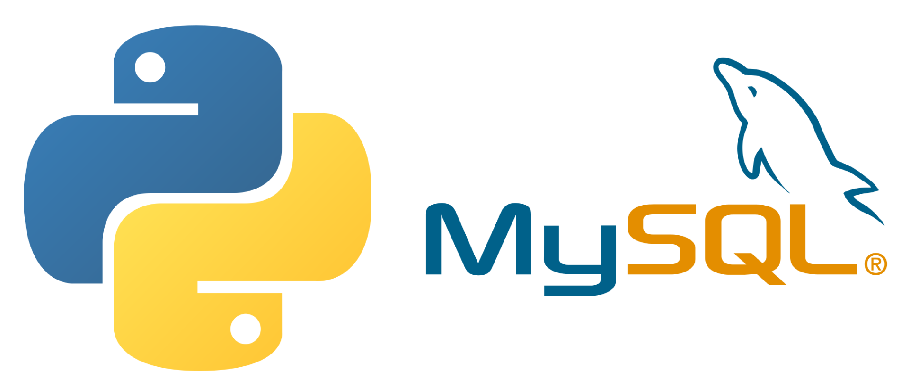

<h1 align="center">Higher Level Programing</h1>

<h2 align="center">About</h2>
This repository contains practical excercises using higher level programming languages. In these projects we learned:

-   Pyhton Sintax
-   Python modules
-   Data structures
-   Test Driven Development
-   Object oriented programming
-   SQL lenguage

<h2 align="center">Projects</h2>

| Project  | Learning Objetive  |
|:-|:-:|
| [0x00-hello_world](./0x00-hello_world) | Python Sintax  |
| [0x01-python-if_else_loops_functions](./0x01-python-if_else_loops_functions)  | How to use functions and loop in python  |
| [0x02-python-import_modules](./0x02-python-import_modules)  | How to import and create modules in python |
| [0x03-python-data_structures](./0x03-python-data_structures)  | How to use lists as stacks and queues  |
| [0x04-python-more_data_structures](./0x04-python-more_data_structures)  | What are dictionary and how to use them  |
| [0x05-python-exceptions](./0x05-python-exceptions)  | How to correctly handle an exception |
| [0x06-python-classes](./0x06-python-classes)  | First steps in oop |
| [0x07-python-test_driven_development](./0x07-python-test_driven_development) | How to write Docstrings to create tests |
| [0x08-python-more_classes](./0x08-python-more_classes) | What is Data Abstraction, Data Encapsulation, and Information Hiding |
| [0x09-python-everything_is_object](./0x09-python-everything_is_object)  | What is the difference between a class and an object or instance |
| [0x0A-python-inheritance](./0x0A-python-inheritance)  | How to inherit class from another |
| [0x0B-python-input_output](./0x0B-python-input_output)  | How to open, read and write on a file |
| [0x0C-python-almost_a_circle](./0x0C-python-almost_a_circle)  | How to serialize and deserialize a Class |
| [0x0D-SQL_introduction](./0x0D-SQL_introduction)  | How to create a database in MySQL |
| [0x0E-SQL_more_queries](./0x0E-SQL_more_queries)  | How to retrieve datas from multiple tables in one request	 ||

<h2 align="center">Credits</h2>
Work is owned and maintained by Daniel Amado (@DanielFep_am). Credits for group projects are displayed in the respective README.md files.
